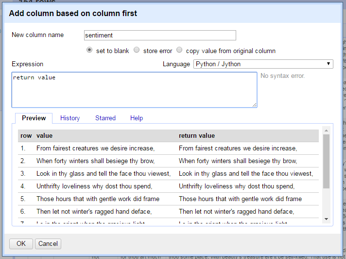

## Example 3: Advanced APIs

*Example 2* demonstrated Refine's fetch function with a simple web API, essentially utilizing URL patterns to request information from a server. 
This workflow uses the HTTP GET protocol, meaning the query is encoded in the URL string, thus limited in length (2048 ASCII characters), complexity, and security.
Many API services that could be used to enhance text data, such as [geocoding](https://en.wikipedia.org/wiki/Geocoding) or [named entity recognition](https://en.wikipedia.org/wiki/Named-entity_recognition), use HTTP POST to transfer information to the server for processing. 
GREL does not have a built in function to use this type of API.
However, the expression window language can be changed to [Jython](http://www.jython.org/), providing a more complete scripting environment where it is possible to implement a POST request.

> [Jython](http://www.jython.org/) is Python implemented for the Java VM and comes bundled with Refine (look for the `.jar` file in `openrefine-2.7-rc.2/webapp/extensions/jython/`).
> The [official documentation](https://github.com/OpenRefine/OpenRefine/wiki/Jython) is sparse.
> The current version is Jython 2.7, based on [Python 2.7](https://docs.python.org/2.7/), and can be extended with non-standard libraries using a [work around](https://github.com/OpenRefine/OpenRefine/wiki/Extending-Jython-with-pypi-modules).
> Keep in mind that spending time writing complex scripts moves away from the strengths of Refine. 
> If it is necessary to develop a lengthy Jython routine, it will likely be more efficient to process the data directly in Python. 
> On the other hand, if you know a handy method to process data in Python 2, Jython is an easy way to apply it in a Refine project.

### Jython in the expression window

Return to the Sonnets project completed in *Example 1*. 
If the tab was closed, click *Open* > *Open Project* and find the Sonnets example (Refine saves everything for you!). 

On the *first* column > *Edit column* > *Add column based on this column*, and name the new column `sentiment`.
On the right side of the *Expression* box is a drop down to change the expression language.
Select *Python / Jython* from the list.



Notice that the preview now shows `null` for the output. 
A Jython expression in Refine must have a `return` statement to add the output to the new cells in the transformation.
Replace the default GREL expression `value` with `return value`. 
The preview will update showing the current cells copied to the output. 
The basic [GREL variables](https://github.com/OpenRefine/OpenRefine/wiki/Variables) can be used in Jython by substituting brackets instead of periods. 
For example, the GREL `cells.last.value` would be Jython `cells['last']['value']`. 

### Jython GET request

To create a HTTP request in Jython, use the standard library [urllib2](http://www.jython.org/docs/library/urllib2.html).
Refine's fetch function can be recreated with Jython to demonstrate the basics of the library. 
In the expression box, type:

```
import urllib2
get = urllib2.urlopen("http://www.jython.org/")
return get.read()
```

The preview should display the HTML source of the Jython home page, this is an HTTP GET request as in previous fetch examples.
Notice that similar to opening and reading a text file with Python, `urlopen()` returns a file-like object that must be `read()` into a string.
The URL could be replaced with `value` to construct a query similar to the fetch used in *Example 2*.
If necessary, a throttle delay can be implemented by importing `time` and adding `time.sleep(15)` to the script. 

### POST request

Urllib2 will automatically send a POST if data is added to the request object.
For example, [Text Processing](http://text-processing.com/) provides natural language processing APIs based on [Python NLTK](http://www.nltk.org/).
The documentation for the [Sentiment Analysis service](http://text-processing.com/docs/sentiment.html) provides a base URL and the name of the key (`text`) used for the data to be analyzed.
No authentication is required and 1,000 calls per day are free.
This type of API is often demonstrated using [curl](https://curl.haxx.se/) on the commandline.
In this case, the example is `curl -d "text=great" http://text-processing.com/api/sentiment/` which can be recreated in Jython to test the service.
Building on the GET expression above, the POST data is added as the second parameter of *urlopen*, thus the request will be in the form `urllib2.urlopen(url,data)`.
Type this script into the expression window:

```
import urllib2
post = urllib2.urlopen("http://text-processing.com/api/sentiment/", "text=what is the sentiment of this sentence?")
return post.read()
```

The preview should show a JSON response with sentiment probability values.
To retrieve sentiment analysis data for the first lines of the sonnets (remember we are still adding a column based on *first*!), put this basic Jython pattern together with the values of the cells.
Paste this script into the expression window:

```
import urllib2
url = "http://text-processing.com/api/sentiment/"
data = "text=" + value
post = urllib2.urlopen(url, data)
return post.read()
```


Click *Ok* and the Jython script will run for every row in the column.
The JSON response can then be parsed using the methods demonstrated in *Example 2*.
Given the small expression window and uniform data, the script above is pragmatically simplified and compressed.
If Refine is encountering problems, it is better to implement a more complete script with error handling.
For example, the POST request script could be rewritten:

```
import urllib2, urllib
url = "http://text-processing.com/api/sentiment/"
data = urllib.urlencode({"text": value.encode("utf-8")})
req = urllib2.Request(url,data)
try:
    post = urllib2.urlopen(req)
except urllib2.URLError as e:
    if hasattr(e, "reason"):
        return "Failed: ", e.reason
    elif hasattr(e, "code"):
        return "Error code: ", e.code
else:
    response = post.read()
    return response
```

this API allows 1000 per day per IP address.

> Some APIs require headers with authentication tokens to be passed with the POST request. 
> Headers can be added as the third parameter of `urllib2.Request()` similar to how data was added in the example above.
> Check the Python [urllib2 documentation](https://docs.python.org/2/library/urllib2.html) and [how-to](https://docs.python.org/2/howto/urllib2.html) for advanced options.
> When harvesting web content, character encoding issues commonly produce errors in Python. 
> Trimming whitespace, using GREL `escape()` / `unescape()`, or Jython `encode("utf-8")` will often fix the problem.

### Compare sentiment

To practice constructing a POST request, read the documentation for [Sentiment Tool](http://sentiment.vivekn.com/docs/api/), another free API.
Find the service URL and data key necessary to modify the Jython pattern above.
Create a new column from *first* named `sentiment2` and test the script.
There are many ways to write it, for example:

```
import urllib2
url = "http://sentiment.vivekn.com/api/text/"
data = "txt=" + value
post = urllib2.urlopen(url, data)
return post.read()
```

The JSON response contains different metrics, but it will be obvious that the APIs disagree on many of the sentiment *labels*. 
These are simple free APIs for demonstration purposes, but it is important to critically investigate services to more fully understand the potential of the metrics.
Both APIs use a [naive bayes classifier](https://en.wikipedia.org/wiki/Naive_Bayes_classifier) to categorize text input.
These models must be trained on pre-labeled data and will be most accurate on similar text.
Text Processing is trained on twitter and movie review corpus[^1], while Sentiment Tool is trained on IMDb movie reviews.[^2]
Thus both are optimized for small bits of modern English language similar to a review.
The models are unlikely to produce quality results for sonnets filled with archaic words and phrases.
In humanities we should be asking questions about the algorithms and thinking critically about the metrics they are capable of producing. 
This is not a new technical skill, but an application of the historian's traditional expertise, not unlike unraveling the bias and limitations of physical primary source materials.

[^1]: Jacob Perkins, "Sentiment Analysis with Python NLTK Text Classification", http://text-processing.com/demo/sentiment/
[^2]: Vivek Narayanan, Ishan Arora, Arjun Bhatia, "Fast and accurate sentiment classification using an enhanced Naive Bayes model", 2013, [arXiv:1305.6143](https://arxiv.org/abs/1305.6143).
