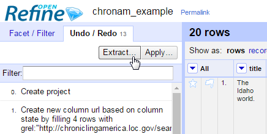
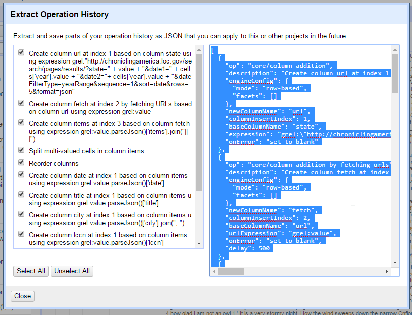
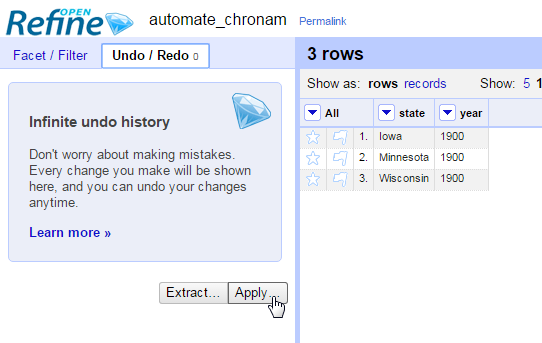
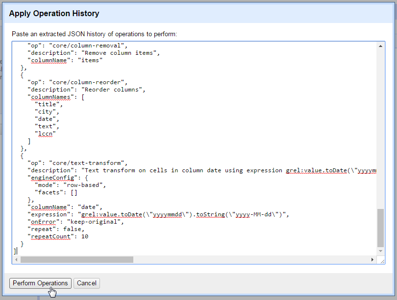

### Automate

The headlines of 1865 from the Northwest are ready to enjoy.
This successful routine can be reused on any data set with the same original columns.
Click the *Open* button in the upper right and start a new project from *Clipboard* using this CSV:

```
state,year
Iowa,1900
Minnesota,1900
Wisconsin,1900
```

Once the project is created, click back on the *Example 2* project tab on your browser. 
Near the upper left, click on the *Undo / Redo* tab.
Click on the *Extract* button.



This opens the *Extract Operation History* dialog box.



With everything selected, copy the complete history from the right side.
Click back on the new project, the *Undo / Redo* tab, and the *Apply* button.



Paste the copied history into the box and click *Preform operations*.



Refine will apply the exact steps used in *Example 2* to the new project. 
When the operations complete, you will have a data set to compare with the Northwest.
