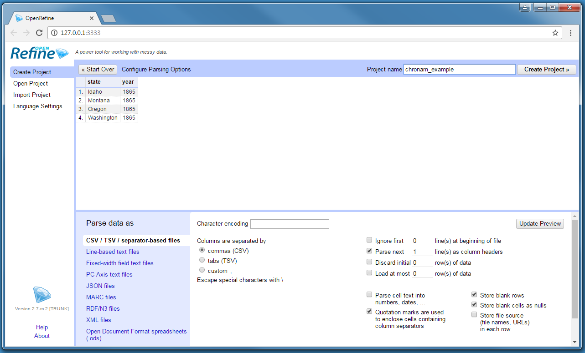
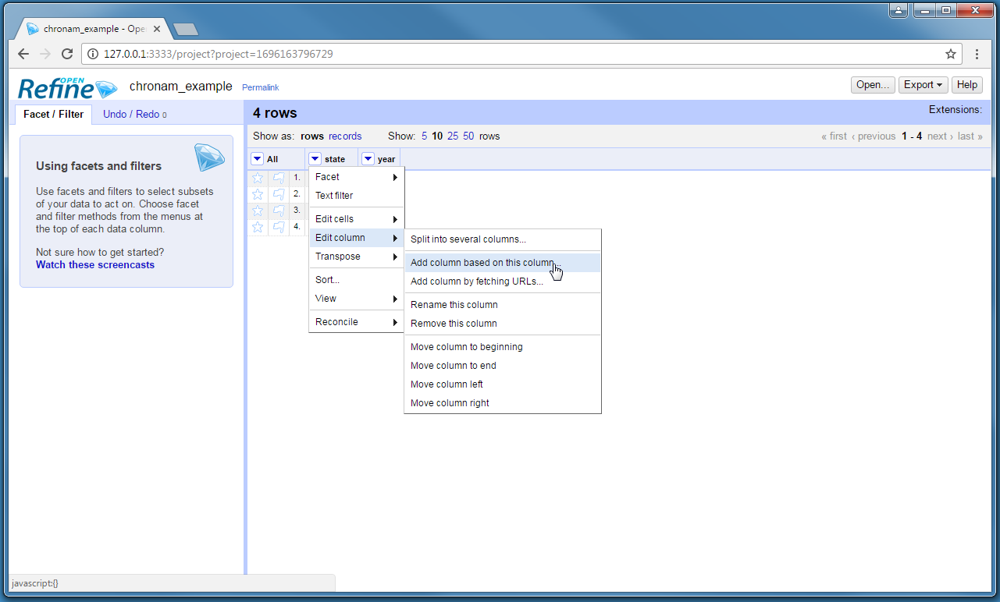
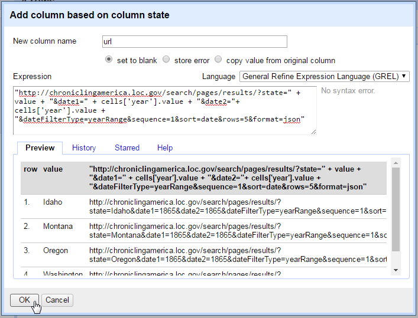
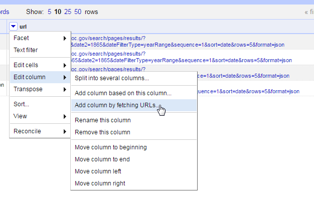

## Example 2: URL Queries and Parsing JSON

Many cultural institutions provide web APIs enabling users to access data about their collections via simple HTTP requests.
This example will use the basic API provided by the [Chronicling America](http://chroniclingamerica.loc.gov/) project to create a small full text data set of newspaper front pages.
Refine is used to construct the query URL, fetch the information, and parse the JSON response.

To get started, it is necessary to understand how the desired content can be harvested.
Chronicling America provides [documentation](http://chroniclingamerica.loc.gov/about/api/) for their API and URL patterns. 
However, it is possible to gain further information by viewing the source of the HTML pages. 
Alternate links in the `<head>` element point to formats available in addition to the HTML document rendered by your browser (for example, `<link rel="alternate" type="application/json" href="/lccn/sn86088527/1917-03-29/ed-1/seq-1.json" />`).
In this case, the information on each page can be retrieved as HTML, Atom-XML, or JSON depending on the options passed with the URL.
Finally, a search link points to an XML document that provides templates for constructing search queries (`<link title="NDNP Page Search" href="/search/pages/opensearch.xml" rel="search" type="application/opensearchdescription+xml" />`).
Together, these hints and documentation are a recipe book explaining how to interact with the server using a public URL.

> Chronicling America is fully open, thus no key or account is needed to access the API and there are no limits on the use. 
> Other APIs are often proprietary and restricted.
> Please review the specific terms of use before web scraping or using the information in research.

### Start Chronicling America Project

To get started after Example 1, click the `Open` button in the upper right, which will open a new Refine tab.
Select `Create project`, and Get Data From `Clipboard`. 
Paste this CSV into the text box:

```
state,year
Idaho,1865
Montana,1865
Oregon,1865
Washington,1865
```

After clicking next, Refine should automatically identify the content as a CSV. 
If so the default parsing options will be correct.
Add a descriptive `Project name` at the top right and click `Create project`.



### Construct a Query

To construct the query URL, create a new column by clicking the menu arrow on the `state` column > `edit column` > `Add column based on this column`.



Give the new column the name `url`, then click in the `Expression` text box.
This box accepts functions written in the General Refine Expression Language ([GREL](https://github.com/OpenRefine/OpenRefine/wiki/General-Refine-Expression-Language)) that will be applied to each cell in the existing column to create values for the new column.

Notice that the default expression is `value`, the GREL variable representing the current value of a cell. 
This means that each cell will be copied to the new column exactly. 
The preview below the expression box should reflex this.
Delete `value`, and paste this expression:

```
"http://chroniclingamerica.loc.gov/search/pages/results/?state=" + value + "&date1=" + cells['year'].value + "&date2=" + cells['year'].value + "&dateFilterType=yearRange&sequence=1&sort=date&rows=5&format=json"
``` 



The preview should update, displaying a URL as output.
This GREL expression combines strings (the characters inclosed by quotes) with values from the CSV to construct a search query URL.
Strings are concatenated using the plus sign.
For example the expression `"one" + "two"` would result in "onetwo".
The components of the URL are based on the API documentation:

- `http://chroniclingamerica.loc.gov/` is the base URL.
- `search/pages/results` is the search service location for individual newspaper pages.
- `?` starts a web form *query string*. A query string is made up of value pairs (`fieldname=value`) separated by `&`. Unlike a normal URL, the query string is not a hierarchical file location, but is passed to the server or page for processing. 

The values from the cells of the CSV are accessed using GREL variables:
- `value` is the current value of each cell. In this case it is the state value listed in the `state` column, thus in row 1 value = Idaho and in row 2 value = Washington. 
- `cells['year'].value` is the GREL variable that retrieves the value from a different column in the same row. In this case it is the value listed in the `year` column. 

Much like using the [advanced search form](http://chroniclingamerica.loc.gov/#tab=tab_advanced_search), the value pairs of the query string set the options for the Chronicling America search. 
Explicitly, the first query URL will ask for newspapers from Idaho (`state=Idaho`), from the year `1865`, only the front pages (`sequence=1`), sorting by date (`sort=date`), returning a maximum of five (`rows=5`) in JSON (`format=json`). 

### Fetch URLs

The `url` column is now a list of web queries that could be accessed with a browser.
Refine's builtin function to retrieve a list of URLs is done by creating a new column.  

Click on the `url` column > `edit column` > `Add column by fetching urls`.



Name the new column `fetch`. 
A `throttle delay` can be set to ensure Refine waits a reasonable amount of time between requests. 
The default is conservative. 
After clicking okay, Refine will start requesting the URLs as if you were opening the pages in your browser, and store each response in the cells of the new column.
In a few seconds, the `fetch` column should be filled with JSON data.

### Parse JSON to Get Items

The first elements of the JSON response look like `"totalItems": 52, "endIndex": 5`. 
This indicates that the search resulted in 52 total items, but the response contains only five (since it was limited by the `rows=5` option).
The Refine project currently has only four rows, but the `fetch` column contains information about a total of twenty newspaper pages nested in the JSON `items` element. 
To construct a orderly data set, it is necessary to parse the JSON and split each item into its own row.

GREL has a builtin function to easily parse JSON. 
Click on the `fetch` column > `edit column` > `Add column based on this column`. 
Name the column `items` and enter the expression:

```
value.parseJson()['items'].join("|||")
```

GREL `parseJson()` allows us to select an element name to retrieve the corresponding values. 
In this case selecting `['items']` exposes the array of newspaper records nested inside the JSON response.
The `join()` function concatenates an array with the given separator resulting in a string value. 
For example, the expression `[1,2,3].join(";")` will result in the string "1;2;3".  
Since the newspaper items contain an OCR text field, the strange separator "|||" is necessary to ensure that it is unique.


> Notice that GREL variables and functions are strung together in sequence using `.`, starting with the raw cell `value`.
> This allows complex operations to be constructed by passing the results of each function to the next.

With the newspaper records isolated, individual rows can be created by splitting the cells.
Click on the `items` column > `edit cells` > `split multivalued cells`, and enter the join used in the last step, `|||`. 

Each of the cells in the `items` column are now split into multiple rows. 
The top the table should read 20 rows.
If you click on Show as `records`, it will read 4, representing our original CSV rows.
Click back on `rows`.

So far in this example, most operations result in creating new columns. 
This is a typical workflow with Refine allowing each transformation to be easily checked against the existing data.
However, at this point all the necessary information is contained in the `items` column. 
It is a good time to clean up the unnecessary columns.
Click on the `all` column > `Edit columns` > `Re-order / remove columns`. 
Drag the unnecessary column names to the right side, then click `ok` to remove them. 
With the original columns removed, both `records` and `rows` will read 20.

### Parse JSON values

To complete the data set, it is necessary to parse each newspaper's JSON record into individual columns. 
This is a very common task, as many web APIs return information in JSON format.
Again, GREL's `parseJson()` function make this easy. 
For each JSON key, create a new column from `items`, parse the JSON, and select the key:

- date: `value.parseJson()['date']`
- title: `value.parseJson()['title']`
- city: `value.parseJson()['city'].join(", ")`
- lccn: `value.parseJson()['lccn']`
- text: `value.parseJson()['ocr_eng']`

After the desired information is extracted, the `items` column can be removed using `Edit column` > `Remove this column`. 
Each of these columns could be further refined using other GREL transformations.
For example, the `date` column could be converted to a more readable format using `value.toDate("yyyymmdd").toString("yyyy-MM-dd")` or `value.splitByLengths(4,2,2).join("-")`.
A URL could be constructed to retrieve the full item based on `lccn` using `"http://chroniclingamerica.loc.gov/lccn/" + value + "/" + cells.date.value.splitByLengths(4,2,2).join("-") + "/ed-1/"`.

### Automate

```
state,year
Iowa,1900
Minnesota,1900
Wisconsin,1900
```

### Going further

This data can be enhanced by other services offered via APIs such as geocoding or named entity recognition. 
Some extensions, such as [Refine-NER-Extension](https://github.com/RubenVerborgh/Refine-NER-Extension), help automate enhancing the data by reconciling with remote sources. However, since many of the APIs are from commercial companies, (often proprietary and restricted, with specific terms of use) the implementation details regularly change, making these extensions difficult to maintain.
