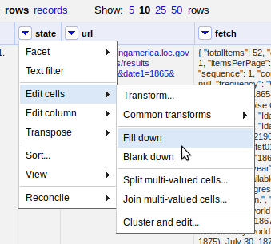

## Example 2: URL Queries and Parsing JSON

Many cultural institutions provide web APIs enabling users to access information about their collections via simple HTTP requests.
This example will harvest data from the [Chronicling America](http://chroniclingamerica.loc.gov/) project to collect a small set of newspaper front pages with full text.
Refine is used to construct the query URL, fetch the information, and parse the JSON response.

> Chronicling America is fully open, thus no key or account is needed to access the API and there are no limits on the use. 
> Other APIs are often proprietary and restricted.
> Please review the specific terms of use before web scraping or using the information in research.
>
> Information about alternative formats and search API are sometimes given in the `<head>` element of a web page. 
> Check for `<link rel="alternate"...`, `<link rel="search"...`, or `<!--` comments which provide hints on how to interact with the site.

### Start Chronicling America Project

To get started after completing Example 1, click the *Open* button in the upper right, which will open a new start tab.
Select *Create project*, and Get Data From *Clipboard*. 
Paste this CSV into the text box:

```
state,year
Idaho,1865
Montana,1865
Oregon,1865
Washington,1865
```

After clicking next, Refine should automatically identify the content as a CSV with the correct parsing options. 
Add a descriptive *Project name* at the top right and click *Create project*.


### Construct a Query

Chronicling America provides [documentation](http://chroniclingamerica.loc.gov/about/api/) for their API and URL patterns. 
It is a recipe book for interacting with the server using public links.
The basic components are:

- The base URL, `http://chroniclingamerica.loc.gov/`
- The search service location for individual newspaper pages, `search/pages/results`
- A web form *query string*, starting with `?` and made up of value pairs (`fieldname=value`) separated by `&`. Much like using the [advanced search form](http://chroniclingamerica.loc.gov/#tab=tab_advanced_search), the value pairs of the query string set the [options](http://chroniclingamerica.loc.gov/search/pages/opensearch.xml). 

Using a GREL expression, the values in the CSV can be combined with these components to construct a search query URL.
On the *state* column > *Edit column* > *Add column based on this column*.
Name the new column `url` and paste in this expression:

```
"http://chroniclingamerica.loc.gov/search/pages/results/?state=" + value.escape('url') + "&date1=" + cells['year'].value.escape('url') + "&date2=" + cells['year'].value + "&dateFilterType=yearRange&sequence=1&sort=date&rows=5&format=json"
``` 

Notice that strings are concatenated using the plus sign.
For example the expression `"one" + "two"` would result in "onetwo".
The values from the cells of the table are accessed using GREL variables.
The current value of each cell in *state* column is represented by `value`.
Values from the same row in other columns can be retrieved using `cells['column name'].value`. 
Thus `cells['year'].value` in row 1 will return "1865" from the *year* column.
The `escape()` function is added to each to ensure the string is useable in a URL (basically the opposite of the `unescape()` function introduced in Example 1). 
 
Explicitly, the first query URL will ask for newspapers from Idaho (`state=Idaho`), from the year `1865`, only the front pages (`sequence=1`), sorting by date (`sort=date`), returning a maximum of five (`rows=5`) in JSON (`format=json`). 

### Fetch URLs

The *url* column is a list of web queries that could be accessed with a browser.
To test, click on a link, which will open it in a new tab.
Fetch the URLs using *url* column *Edit column* > *Add column by fetching urls*.
Name the new column `fetch`. 
In a few seconds, the operation should complete and the *fetch* column will be filled with JSON data.

### Parse JSON to Get Items

The first elements of the JSON response look like `"totalItems": 52, "endIndex": 5`. 
This indicates that the search resulted in 52 total items, but the response contains only five (since it was limited by the `rows=5` option).
The Refine project currently has four rows, but the `fetch` column contains information about a total of twenty newspaper pages nested in the JSON `items` element. 
To construct a orderly data set, it is necessary to parse the JSON and split each item into its own row.

GREL's `parseJson()` function allows us to select an element name to retrieve the corresponding values.
Click on the *fetch* column > *Edit column* > *Add column based on this column*. 
Name the column `items` and enter the expression:

```
value.parseJson()['items'].join("|||")
```


Selecting `['items']` exposes the array of newspaper records nested inside the JSON response.
The `join()` function concatenates the array with the given separator resulting in a string value.
Since the newspaper items contain an OCR text field, the strange separator "|||" is necessary to ensure that it is unique and can be used to split the values.

### Split Multivalued Cells

With the individual newspapers isolated, separate rows can be created by splitting the cells.
Click on the *items* column > *Edit cells* > *Split multivalued cells*, and enter the join used in the last step, `|||`. 

After the operation, the top of the project table should read 20 rows.
Clicking on Show as *records* should read 4, representing the original CSV rows.
Notice that the new rows are empty in all columns except *items*. 
To ensure the state is available with each newspaper, the empty values can be filled with the `Fill down` function.
Click on the *state* column > *Edit cells* > *Fill down*. 



This is a good point to clean up the unnecessary columns.
Click on the *All* column > *Edit columns* > *Re-order / remove columns*.
Drag all columns except *state* and *items* to the right side, then click *ok* to remove them. 
With the original columns removed, both *records* and *rows* will read 20.

### Parse JSON values

To complete the data set, it is necessary to parse each newspaper's JSON record into individual columns. 
This is a common task, as many web APIs return information in JSON format.
Again, GREL's `parseJson()` function makes this easy. 
For each JSON key, create a new column from *items* by parsing the JSON and selecting the key:

- date, `value.parseJson()['date']`
- title, `value.parseJson()['title']`
- city, `value.parseJson()['city'].join(", ")`
- lccn, `value.parseJson()['lccn']`
- text, `value.parseJson()['ocr_eng']`

After the desired information is extracted, the *items* column can be removed using *Edit column* > *Remove this column*. 

Each column could be further refined using other GREL transformations.
For example, to convert the date to a more readable format, use GREL date functions.
Click on the *date* column > *Edit cells* > *Transform* and use the expression `value.toDate("yyyymmdd").toString("yyyy-MM-dd")`.

Another common workflow is to use the attributes to construct further URL queries extending the data.
For example, a link to the full issue information can be constructed based on the *lccn*.
On *lccn* column > *Edit column* > *Add column based on this column* and use the expression `"http://chroniclingamerica.loc.gov/lccn/" + value + "/" + cells['date'].value + "/ed-1.json"`.
Fetching this URL returns a complete list of the issue's pages, which could then be harvested. 

Now you are ready to enjoy reading the front pages of the NW in 1865!

> This data can be enhanced by other services offered via APIs such as geocoding or named entity recognition. 
> Some extensions, such as [Refine-NER-Extension](https://github.com/RubenVerborgh/Refine-NER-Extension), help automate enhancing the data by reconciling with remote sources. > However, since many of the APIs are from commercial companies, (often proprietary and restricted, with specific terms of use) the implementation details regularly change, making these extensions difficult to maintain.
> Add to a map using [Google Geocoding API](https://developers.google.com/maps/documentation/geocoding/intro)

### Automate

This routine can easily be reused on the 

```
state,year
Iowa,1900
Minnesota,1900
Wisconsin,1900
```
