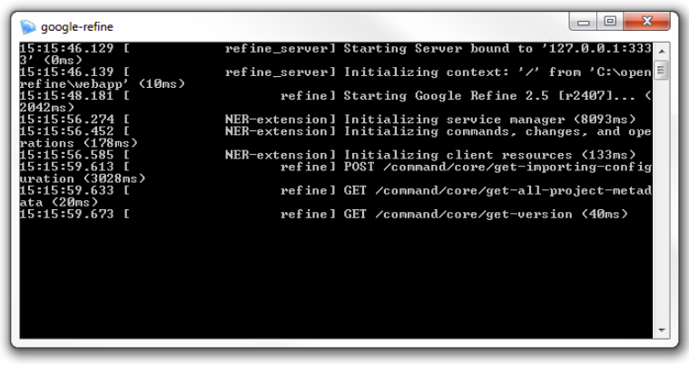

## Lesson Goals

OpenRefine is a powerful tool for exploring, cleaning, and transforming data. 
An earlier [PH lesson](http://programminghistorian.org/lessons/cleaning-data-with-openrefine) introduced the basic functionality of Refine to efficiently discover and correct inconsistency in a data set.
Building on those essential data skills, this lesson focuses on Refine's ability to fetch urls and parse web content.
Examples introduce some of the advanced features to transform and enhance a data set. 

## Why Use OpenRefine

David Huynh (the creator of Freebase Gridworks (2009) which became GoogleRefine (2010) and then OpenRefine (2012+)), says that Refine is:
- more powerful than a spreadsheet
- more interactive and visual than scripting
- more provisional / exploratory / experimental / playful than a database
([David Huynh](http://web.archive.org/web/20150528125345/http://davidhuynh.net/spaces/nicar2011/tutorial.pdf))

It is a unique tool that combines the power of database and scripting languages into a more interactive and user friendly visual interface. 
Because of this flexibility it has been embraced by [journalists](https://www.propublica.org/nerds/item/using-google-refine-for-data-cleaning), [librarians](http://data-lessons.github.io/library-openrefine/), and [scientists](http://www.datacarpentry.org/OpenRefine-ecology-lesson/) needing to wrangle data from diverse sources and formats. 
As seen in other PH lessons [wget](http://programminghistorian.org/lessons/applied-archival-downloading-with-wget), the ability to create data sets from unstructured documents available on the web opens unique possibilities for research. 
Refine's workflow is particularly suited for this task, 
allowing users to fetch urls and process the results into a clean data set in an iterative, exploratory manner.

## Installation and Setup

OpenRefine is a [free software](https://www.gnu.org/philosophy/free-sw.en.html), [open source](https://github.com/OpenRefine/OpenRefine), extensible, Java application, that runs offline in web browser. Full documentation is available on the [official wiki](https://github.com/OpenRefine/OpenRefine/wiki/).

1. Install [Java](http://java.com/en/) if you do not have it (be sure to uncheck the "recommended" option to add Yahoo to your browsers!)
2. Download the most recent [OpenRefine package](http://openrefine.org/download.html) for your OS.
3. Extract the package to a permanent location, for example in your User directory or Documents. On Windows, unzip by right clicking and selecting Extract All. On Mac, drag `dmg` to the application folder (Mac has known [issues](https://github.com/OpenRefine/OpenRefine/wiki/Installation-Instructions#mac-osx), try these [solutions](https://gist.github.com/evanwill/138ff4a31a4bfd61c5626e43bee22772)). On Linux, unpack to desired location with `tar xzf google-refine.tar.gz`. 
4. Start Refine: Windows, double click `openrefine.exe`. Mac, click Refine icon. Linux, in the Refine directory open terminal and `./refine`. The application should start running in a terminal window and the default web browser should automatically open the GUI at [http://127.0.0.1:3333](http://127.0.0.1:3333)

**To shut down:** close browser window then close the host window with `Ctrl+C`.

