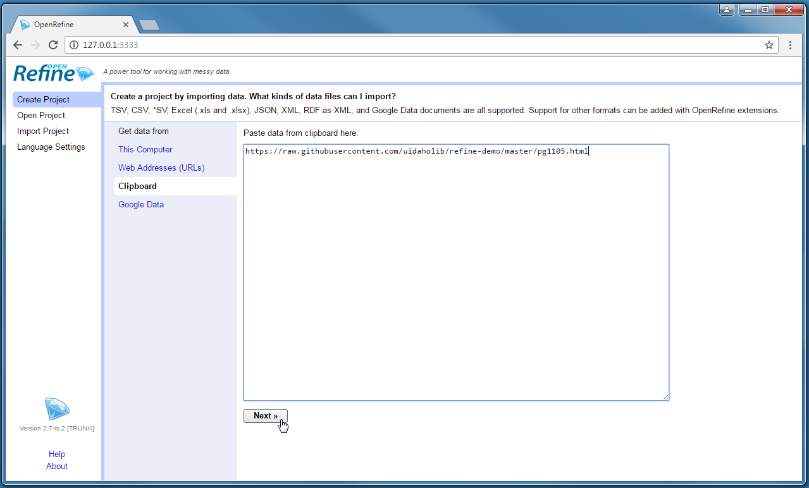
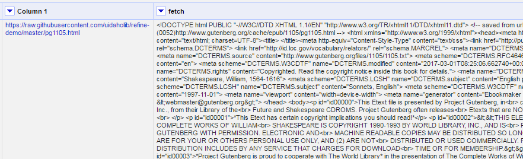
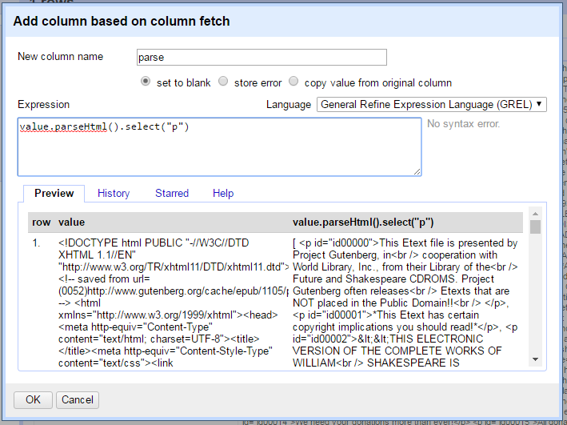
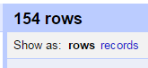
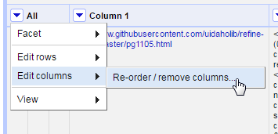
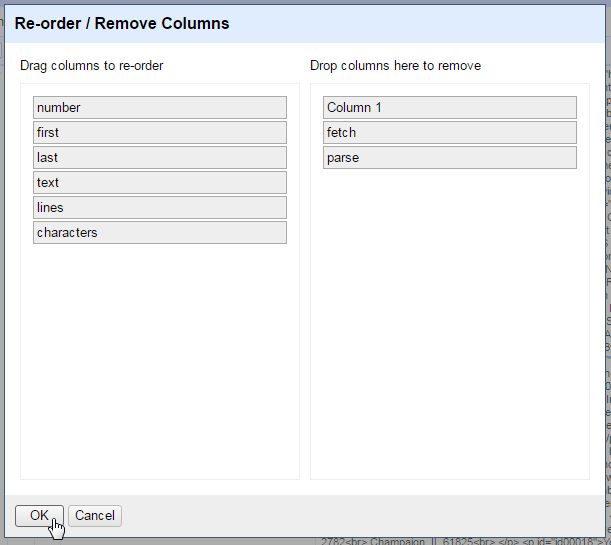
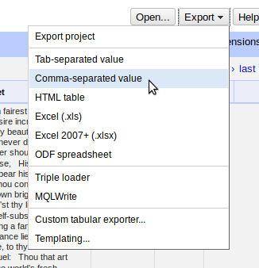
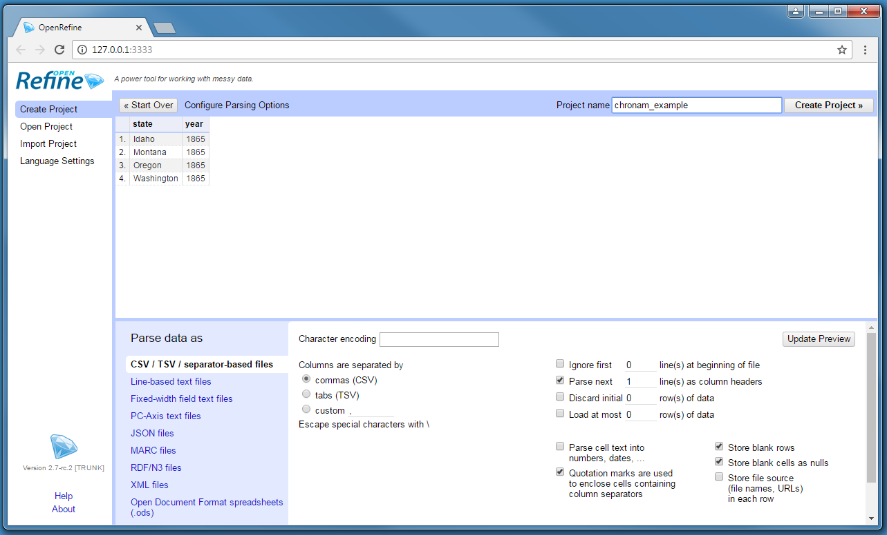
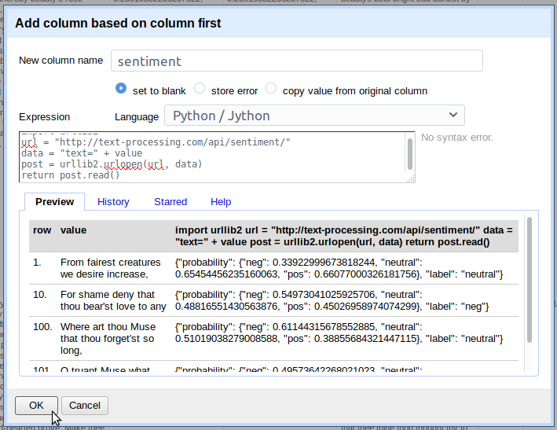

## Lesson Goals

OpenRefine is a powerful tool for exploring, cleaning, and transforming data. 
An earlier Programming Historian [lesson](http://programminghistorian.org/lessons/cleaning-data-with-openrefine) introduced the basic functionality of Refine to efficiently discover and correct inconsistency in a data set.
Building on those essential data wrangling skills, this lesson focuses on Refine's ability to fetch urls and parse web content.
Examples introduce some of the advanced features to transform and enhance a data set including: 

- fetch URLs using Refine
- construct URL queries to retrieve information from a simple web API
- parse HTML and JSON responses to extract relevant data
- use array functions to manipulate string values

### Why Use OpenRefine?

The ability to create data sets from unstructured documents available on the web opens possibilities for research using digitized primary materials, web archives, texts, and contemporary media streams. 
Programming Historian lessons introduce a number of methods to gather and interact with this content, from [wget](http://programminghistorian.org/lessons/applied-archival-downloading-with-wget) to [Python](http://programminghistorian.org/lessons/intro-to-beautiful-soup).
When working with text documents, Refine is particularly suited for this task, allowing users to fetch urls and directly process the results in an iterative, exploratory manner.

> David Huynh, the creator of Freebase Gridworks (2009) which became GoogleRefine (2010) and then OpenRefine (2012+), says Refine is:
> 
> - more powerful than a spreadsheet
> - more interactive and visual than scripting
> - more provisional / exploratory / experimental / playful than a database [^huynh]

[^huynh]: David Huynh, "Google Refine", Computer-Assisted Reporting Conference 2011, http://web.archive.org/web/20150528125345/http://davidhuynh.net/spaces/nicar2011/tutorial.pdf.

Refine is a unique tool that combines the power of databases and scripting languages into an interactive and user friendly visual interface. 
Because of this flexibility it has been embraced by [journalists](https://www.propublica.org/nerds/item/using-google-refine-for-data-cleaning), [librarians](http://data-lessons.github.io/library-openrefine/), [scientists](http://www.datacarpentry.org/OpenRefine-ecology-lesson/), and others needing to wrangle data from diverse sources and formats into structured information.


> OpenRefine is a [free](https://www.gnu.org/philosophy/free-sw.en.html) and [open source](https://github.com/OpenRefine/OpenRefine) Java application.
> The user interface is rendered by your web browser, but Refine is not a web application. No information is sent online and no internet connection is necessary.
> Full documentation is available on the [official wiki](https://github.com/OpenRefine/OpenRefine/wiki/).
> For installation and staring Refine check this [workshop page](https://evanwill.github.io/clean-your-data/3-start.html).

### Examples

This lesson presents three examples demonstrating workflows to harvest and process data from the web.
First, "Fetching and Parsing HTML" introduces functions to parse an HTML document into a structured data set.
Second, "URL Queries and Parsing JSON" introduces interacting with a simple web API to construct a full text data set of historic newspaper front pages. 
Finally, "Advanced APIs" demonstrates using Jython to implement a POST request to a natural language processing web service API.

## Example 1: Fetching and Parsing HTML

This example downloads a single web page to parse into a structured table using Refine's built in functions.
A similar workflow can be applied to a list of URLs, often generated by parsing another web page, creating a flexible web harvesting tool. 
The raw data for this example is an HTML copy of Shakespeare's [Sonnets](http://www.gutenberg.org/ebooks/1105) from [Project Gutenberg](http://www.gutenberg.org/).
Processing a book of poems into structured data enables new ways of reading text, allowing us to sort, manipulate, and connect with other information. 

> Please note that Project Gutenberg provides [feeds](http://www.gutenberg.org/wiki/Gutenberg:Feeds) to bulk download catalog data. 
> Their public website should not be used for web scraping purposes.
> A copy of the HTML ebook is hosted on GitHub for this example to avoid redirects built in to the Gutenberg site.

### Start Sonnets Project

Start OpenRefine, select *Create project*, and Get Data From *Clipboard*. 
Paste this URL into the text box: 

```
https://raw.githubusercontent.com/uidaholib/refine-demo/master/pg1105.html`
```



After clicking next, Refine should automatically identify the content as a line-based text file and the default parsing options should be correct.
Add a descriptive *Project name* at the top right and click *Create project*.
This will result in a project with one column and one row. 

### Fetch HTML

Refine's builtin function to retrieve a list of URLs is done by creating a new column.
Click on the menu arrow of *Column 1* > *Edit column* > *Add column by fetching urls*.


Name the new column `fetch`. 
The *throttle delay* option sets a pause time between requests to avoid being blocked by a server.
The default is conservative. 
After clicking okay, Refine will start requesting the URLs from the base column as if you were opening the pages in your browser, and will store each response in the cells of the new column.
In this case, there is one URL in *Column 1* resulting in one cell in the *fetch* column containing the full source for the Sonnets web page. 



### Parse HTML

Much of the web page is not sonnet text and must be removed to create a clean data set.
First, it is necessary to identify a pattern that can isolate the desired content.
Items will often be nested in a unique container or given a meaningful class or id.
Click on the URL in *Column 1* to open the source in a new tab.
In this case the sonnets page does not have distinctive semantic markup, but each poem is contained inside a single `<p>` element. 
Thus, if all the paragraphs are selected, the sonnets can be extracted from the array.

On the *fetch* column, click on the menu arrow > *edit column* > *Add column based on this column*.
Give the new column the name `parse`, then click in the *Expression* text box.
Values in Refine can be transformed using the General Refine Expression Language ([GREL](https://github.com/OpenRefine/OpenRefine/wiki/General-Refine-Expression-Language)).
This box accepts GREL expressions that will be applied to each cell in the existing column to create values for the new one.
The default expression is `value`, the GREL variable representing the current value of a cell. 
This means that each cell will be copied to the new column. 
The preview below the expression box will reflect this.

GREL's `parseHtml()` function can read HTML content, allowing elements to be accessed using the jsoup [selector syntax](https://jsoup.org/cookbook/extracting-data/selector-syntax).
Delete `value`, then type `value.parseHtml().select("p")` into the expression box.



Notice that the preview now shows an [array](https://en.wikipedia.org/wiki/Array_data_type) of all the `p` elements found in the page.
Refine represents an array as a comma separated list enclosed in square brackets, for example `[ "one", "two", "three" ]`.

Try the following GREL expressions and watch the preview window to understand how they function.
Adding an index number to the expression selects an element from the array, for example `value.parseHtml().select("p")[0]`.
The beginning of the file contains many paragraphs of license information that are unnecessary for the data set. 
Skipping ahead, the first sonnet is found at `value.parseHtml().select("p")[37]`. 
GREL also supports using negative index numbers, thus `value.parseHtml().select("p")[-1]` will return the last item in the array. 
Working backwards, the last sonnet is at index `[-3]`.

Using these index numbers, it is possible to slice the array, extracting only the range of `p` that contain sonnets. 
Add the `slice()` function to the expression to preview the sub-set: `value.parseHtml().select("p").slice(37,-2)`.

> GREL variables and functions are strung together in sequence using a period, often starting with the raw cell `value`.
> This allows complex operations to be constructed by passing the results of each function to the next.
> Notice how it is possible to gradually build up an expression while checking the preview to see the result.
> Refine is visual and iterative. 
> Test out a transformation to see what happens--it is very easy to undo! 
> The full history of operations is recorded in the `Undo / Redo` tab. 

Clicking `ok` with this expression will result in a blank column, a common cause of confusion when working with arrays.
Refine will not store an array object as a cell value. 
It is necessary to use `toString()` or `join()` to convert the array into a string variable.
The `join()` function concatenates an array with the specified separator. 
For example, the expression `[ "one", "two", "three" ].join(";")` will result in the string "one;two;three".
Thus, the final expression to create the *parse* column is:

```
value.parseHtml().select("p").slice(37,-2).join("|")
```

Click Ok to create the column.

### Split Cells

The *parse* column now contains all the sonnets separated by "|", but the project still contains only one row. 
Individual rows for each sonnet can be created by splitting the cell.
Click the menu arrow on the *parse* column > *edit cells* > *split multivalued cells*. 
Enter the separator `|` that was used to `join` in the last step.


After this operation, the top of the project table should now read 154 rows.
Below the number is an option toggle "Show as: *rows* *records*".
Clicking on *records* will group the rows based on the original table, in this case it will read 1.
Keeping track of these numbers is an important "sanity check" when transforming data in Refine.
The 154 rows make sense because the ebook contained 154 sonnets, while 1 record represents the original table with only one row.
An unexpected number would indicate a problem with the transformation.



Each cell in the *parse* column now contains one sonnet surround by a `<p>` tag.
The tags can be cleaned up by parsing the HTML again.
Click on the *parse* column and select *edit cells* > *transform*.
This will bring up a dialog box similar to create new column.
Transform will overwrite the cells of the current column rather than creating a one.

In the expression box, type `value.parseHtml()`.
The preview will show a complete HTML tree starting with the `<html>` element.
It is important to note that `parseHtml()` will automatically fill in missing tags, allowing it to parse these cell values despite not being valid HTML documents.
Select the `p` tag, add an index number, and use the function `innerHtml()` to extract the sonnet text:

```
value.parseHtml().select("p")[0].innerHtml()
```

Click Ok to transform all 154 cells in the column. 


> In the expression above `select` returns an array of `p` elements even though there is only one in each cell.
> Attempting to pass an array to `innerHtml` will raise an error.
> Thus, an index number is necessary to select the first (and only) item in the array to pass the correct object type to `innerHtml`.
> Keep data object types in mind when debugging GREL expressions!

### Unescape

Each cell is filled with `&nbsp;`, an HTML entity used to represent "no-break space" since browsers ignore extra white space in the source.
These entities are common when harvesting web pages and can be quickly replaced with the corresponding plain text characters using the `unescape()` function.
On the *parse* column, select *Edit cells* > *Transform* and type `value.unescape('html')` in the expression box.
The entities will be replaced with normal whitespace.

### Extract Information with Array Functions

[GREL array functions]((https://github.com/OpenRefine/OpenRefine/wiki/GREL-Array-Functions) provide a powerful way to manipulate text data and can be used to finish processing the sonnets.
Any string value can be turned into an array using the `split()` function by providing the character or expression that separates the items (basically the opposite of `join()`). 

In the sonnets each line ends with `<br />`, providing a convenient separator for splitting.
The expression `split("<br />")` will create an array of the lines of each sonnet. 
Index numbers and slices can then be used to populate new columns.
Keep in mind that Refine will not output an array directly to a cell.
It will have to be converted back into a string value with `join()`.

Furthermore, the sonnet text contains a huge amount of unnecessary white space that was used to layout the poems in the ebook.
This can be cut from each line using the `trim()` function.
Trim automatically removes all leading and trailing white space, an essential for data cleaning. 

Create new columns from the *parse* column using *Edit column* > *Add column based on this column* with these names and expressions:

- number, `value.split("<br />")[0].trim()`
- first, `value.split("<br />")[1].trim()`

These expressions extract a single line from the array and trim, creating clean columns representing the sonnet number and first line. 
The next column to create is the full sonnet text which contains multiple lines.
However, `trim()` will only clean the beginning and end of the cell, leaving unnecessary whitespace in the body of the sonnet.
To trim each line individually use the GREL `forEach` control, a powerful loop that iterates over an array.

The `forEach()` expression asks for an array, a variable name, and a function applied to the variable.
Create new column named *text* from the *parse* column, and type `forEach(value.split("<br />"),lines,lines.trim())` in the expression box.
Look closely at the components:

- Array: `value.split("<br />")` creates an array from the string value in each cell.
- Variable: each item in the array is then represented as the variable `lines` (it could be anything, `v` is often used).
- Function: each item is then evaluated separately with the specified expression, `lines.trim()`.

The results of each separate function is returned as a new array.
Thus, the expression above will trim the individual line in each cell of the *parse* column.
Because the result is a new array, additional functions can be applied to the end of `forEach()`, such as slice and join.
The final expression to extract and clean the full sonnet text is:

```
forEach(value.split("<br />"),lines,lines.trim()).slice(1).join("\n")
```


And add another new column from *parse* named *last* to represent the final couplet lines using:

```
forEach(value.split("<br />"),lines,lines.trim()).slice(-3).join("\n")
```

Finally, numeric columns can be added using the `length()` function.
Create new columns from the *text* column with the names and expressions below:

- characters, `value.length()`
- lines, `value.split(/\n/).length()`

### Cleanup and Export

In this example, many operations result in creating new columns. 
This is a typical Refine workflow allowing each transformation to be easily checked against the existing data.
At this point the unnecessary columns can be removed. 
Click on the *All* column > *Edit columns* > *Re-order / remove columns*.



Drag unwanted column names to the right side, in this case *Column 1*, *fetch*, and *parse*. 
Drag the remaining columns into the desired order on the left side.
Click *ok* to remove and reorder the data set. 



Use the export button to generate a version of the new sonnet table for use outside of Refine.



## Example 2: URL Queries and Parsing JSON

Many cultural institutions provide web APIs enabling users to access information about their collections via simple HTTP requests.
These sources enable new queries and aggregations of text that were previously impossible, cutting across boundaries of repositories and collections to enable large scale analysis of both content and metadata.
This example will harvest data from the [Chronicling America](http://chroniclingamerica.loc.gov/) project to collect a small set of newspaper front pages with full text.
Following a common web scraping workflow, Refine is used to construct the query URL, fetch the information, and parse the JSON response.

> Chronicling America is fully open, thus no key or account is needed to access the API and there are no limits on the use. 
> Other aggregators are often proprietary and restricted.
> Please review the specific terms of use before web scraping or using the information in research.

### Start Chronicling America Project

To get started after completing Example 1, click the *Open* button in the upper right.
A new tab will open with the Refine start project view. 
The tab with the *Example 1* project can be left open without impacting performance.
Select *Create project*, and Get Data From *Clipboard*. 
Paste this CSV into the text box:

```
state,year
Idaho,1865
Montana,1865
Oregon,1865
Washington,1865
```

After clicking next, Refine should automatically identify the content as a CSV with the correct parsing options. 
Add a descriptive *Project name* at the top right and click *Create project*.



### Construct a Query

Chronicling America provides [documentation](http://chroniclingamerica.loc.gov/about/api/) for their API and URL patterns. 
It is a recipe book for interacting with the server using public links.
The basic components are:

- The base URL, `http://chroniclingamerica.loc.gov/`
- The search service location for individual newspaper pages, `search/pages/results`
- A web form *query string*, starting with `?` and made up of value pairs (`fieldname=value`) separated by `&`. Much like using the [advanced search form](http://chroniclingamerica.loc.gov/#tab=tab_advanced_search), the value pairs of the query string set the [options](http://chroniclingamerica.loc.gov/search/pages/opensearch.xml). 

Using a GREL expression, the values in the CSV can be combined with these components to construct a search query URL.
On the *state* column > *Edit column* > *Add column based on this column*.
Name the new column `url` and paste in this expression:

```
"http://chroniclingamerica.loc.gov/search/pages/results/?state=" + value.escape('url') + "&date1=" + cells['year'].value.escape('url') + "&date2=" + cells['year'].value + "&dateFilterType=yearRange&sequence=1&sort=date&rows=5&format=json"
``` 

Notice that strings are concatenated using the plus sign.
For example the expression `"one" + "two"` would result in "onetwo".
The values from the cells of the table are accessed using GREL variables.
The current value of each cell in *state* column is represented by `value`.
Values from the same row in other columns can be retrieved using `cells['column name'].value`. 
Thus `cells['year'].value` in row 1 will return "1865" from the *year* column.
The `escape()` function is added to ensure the string is useable in a URL (basically the opposite of the `unescape()` function introduced in Example 1). 
 
Explicitly, the first query URL will ask for newspapers from Idaho (`state=Idaho`), from the year `1865`, only the front pages (`sequence=1`), sorting by date (`sort=date`), returning a maximum of five (`rows=5`) in JSON (`format=json`). 

> In addition to formal documentation, information about alternative formats and search API are sometimes given in the `<head>` element of a web page. 
> Check for `<link rel="alternate"...`, `<link rel="search"...`, or `<!--` comments which provide hints on how to interact with the site.

### Fetch URLs

The *url* column is a list of web queries that could be accessed with a browser.
To test, click on a link, which will open it in a new tab.
Fetch the URLs using *url* column *Edit column* > *Add column by fetching urls*.
Name the new column `fetch`. 
In a few seconds, the operation should complete and the *fetch* column will be filled with [JSON](http://www.json.org/) data.

### Parse JSON to Get Items

The first *name/value* pairs of the query response look like `"totalItems": 52, "endIndex": 5`. 
This indicates that the search resulted in 52 total items, but the response contains only five (since it was limited by the `rows=5` option).
The JSON key `items` contains an array of the individual newspapers returned by the search.
To construct a orderly data set, it is necessary to parse the JSON and split each newspaper into its own row.

GREL's `parseJson()` function allows us to select a key name to retrieve the corresponding values.
Click on the *fetch* column > *Edit column* > *Add column based on this column*. 
Name the column `items` and enter the expression:

```
value.parseJson()['items'].join("|||")
```


Selecting `['items']` exposes the array of newspaper records nested inside the JSON response.
The `join()` function concatenates the array with the given separator resulting in a string value.
Since the newspaper items contain an OCR text field, the strange separator "|||" is necessary to ensure that it is unique and can be used to split the values.

### Split Multivalued Cells

With the individual newspapers isolated, separate rows can be created by splitting the cells.
Click on the *items* column > *Edit cells* > *Split multivalued cells*, and enter the join used in the last step, `|||`. 

After the operation, the top of the project table should read 20 rows.
Clicking on Show as *records* should read 4, representing the original CSV rows.
Notice that the new rows are empty in all columns except *items*. 
To ensure the state is available with each newspaper, the empty values can be filled with the `Fill down` function.
Click on the *state* column > *Edit cells* > *Fill down*. 


This is a good point to clean up the unnecessary columns.
Click on the *All* column > *Edit columns* > *Re-order / remove columns*.
Drag all columns except *state* and *items* to the right side, then click *ok* to remove them. 
With the original columns removed, both *records* and *rows* will read 20.

### Parse JSON values

To complete the data set, it is necessary to parse each newspaper's JSON record into individual columns. 
This is a common task, as many web APIs return information in JSON format.
Again, GREL's `parseJson()` function makes this easy. 
Create a new column from *items* for each newspaper metadata element by parsing the JSON and selecting the key:

- date, `value.parseJson()['date']`
- title, `value.parseJson()['title']`
- city, `value.parseJson()['city'].join(", ")`
- lccn, `value.parseJson()['lccn']`
- text, `value.parseJson()['ocr_eng']`

After the desired information is extracted, the *items* column can be removed using *Edit column* > *Remove this column*. 

Each column could be further refined using other GREL transformations.
For example, to convert the date to a more readable format, use [date functions](https://github.com/OpenRefine/OpenRefine/wiki/GREL-Date-Functions).
Click on the *date* column > *Edit cells* > *Transform* and use the expression `value.toDate("yyyymmdd").toString("yyyy-MM-dd")`.

Another common workflow is to extend the data with further URL queries.
For example, a link to the full issue information can be created based on the *lccn*.
On *lccn* column > *Edit column* > *Add column based on this column* and use the expression `"http://chroniclingamerica.loc.gov/lccn/" + value + "/" + cells['date'].value + "/ed-1.json"`.
Fetching this URL returns a complete list of the issue's pages, which could then be harvested. 

The headlines of 1865 from the Northwest are ready to enjoy!

## Example 3: Advanced APIs

*Example 2* demonstrated Refine's fetch function with a simple web API, essentially utilizing URL patterns to request information from a server. 
This workflow uses the HTTP GET protocol, meaning the query is encoded in the URL string, thus limited in length (2048 ASCII characters), complexity, and security.
Many API services that could be used to enhance text data, such as [geocoding](https://en.wikipedia.org/wiki/Geocoding) or [named entity recognition](https://en.wikipedia.org/wiki/Named-entity_recognition), use HTTP POST to transfer information to the server for processing. 
GREL does not have a built in function to use this type of API.
However, the expression window language can be changed to [Jython](http://www.jython.org/), providing a more complete scripting environment where it is possible to implement a POST request.

> [Jython](http://www.jython.org/) is Python implemented for the Java VM and comes bundled with Refine (look for the `.jar` file in `openrefine-2.7-rc.2/webapp/extensions/jython/`).
> The [official documentation](https://github.com/OpenRefine/OpenRefine/wiki/Jython) is sparse.
> The current version is Jython 2.7, based on [Python 2.7](https://docs.python.org/2.7/), and can be extended with non-standard libraries using a [work around](https://github.com/OpenRefine/OpenRefine/wiki/Extending-Jython-with-pypi-modules).
> Keep in mind that spending time writing complex scripts moves away from the strengths of Refine. 
> If it is necessary to develop a lengthy Jython routine, it will likely be more efficient to process the data directly in Python. 
> On the other hand, if you know a handy method to process data in Python 2, Jython is an easy way to apply it in a Refine project.

### Jython in the expression window

Return to the Sonnets project completed in *Example 1*. 
If the tab was closed, click *Open* > *Open Project* and find the Sonnets example (Refine saves everything for you!). 

On the *first* column > *Edit column* > *Add column based on this column*, and name the new column `sentiment`.
On the right side of the *Expression* box is a drop down to change the expression language.
Select *Python / Jython* from the list.


Notice that the preview now shows `null` for the output. 
A Jython expression in Refine must have a `return` statement to add the output to the new cells in the transformation.
Replace the default GREL expression `value` with `return value`. 
The preview will update showing the current cells copied to the output. 
The basic [GREL variables](https://github.com/OpenRefine/OpenRefine/wiki/Variables) can be used in Jython by substituting brackets instead of periods. 
For example, the GREL `cells.last.value` would be Jython `cells['last']['value']`. 

### Jython GET request

To create a HTTP request in Jython, use the standard library [urllib2](http://www.jython.org/docs/library/urllib2.html).
Refine's fetch function can be recreated with Jython to demonstrate the basics of the library. 
In the expression box, type:

```
import urllib2
get = urllib2.urlopen("http://www.jython.org/")
return get.read()
```

The preview should display the HTML source of the Jython home page, this is an HTTP GET request as in previous fetch examples.
Notice that similar to opening and reading a text file with Python, `urlopen()` returns a file-like object that must be `read()` into a string.
The URL could be replaced with `value` to construct a query similar to the fetch used in *Example 2*.
If necessary, a throttle delay can be implemented by importing `time` and adding `time.sleep(15)` to the script. 

### POST request

Urllib2 will automatically send a POST if data is added to the request object.
For example, [Text Processing](http://text-processing.com/) provides natural language processing APIs based on [Python NLTK](http://www.nltk.org/).
The documentation for the [Sentiment Analysis service](http://text-processing.com/docs/sentiment.html) provides a base URL and the name of the key (`text`) used for the data to be analyzed.
No authentication is required and 1,000 calls per day are free.
This type of API is often demonstrated using [curl](https://curl.haxx.se/) on the commandline.
In this case, the example is `curl -d "text=great" http://text-processing.com/api/sentiment/` which can be recreated in Jython to test the service.
Building on the GET expression above, the POST data is added as the second parameter of *urlopen*, thus the request will be in the form `urllib2.urlopen(url,data)`.
Type this script into the expression window:

```
import urllib2
post = urllib2.urlopen("http://text-processing.com/api/sentiment/", "text=what is the sentiment of this sentence?")
return post.read()
```

The preview should show a JSON response with sentiment probability values.
To retrieve sentiment analysis data for the first lines of the sonnets (remember we are still adding a column based on *first*!), put this basic Jython pattern together with the values of the cells.
Paste this script into the expression window:

```
import urllib2
url = "http://text-processing.com/api/sentiment/"
data = "text=" + value
post = urllib2.urlopen(url, data)
return post.read()
```



Click *Ok* and the Jython script will run for every row in the column.
The JSON response can then be parsed using the methods demonstrated in *Example 2*.
Given the small expression window and uniform data, the script above is pragmatically simplified and compressed.
If Refine is encountering problems, it is better to implement a more complete script with error handling.
For example, the POST request script could be rewritten:

```
import urllib2, urllib
url = "http://text-processing.com/api/sentiment/"
data = urllib.urlencode({"text": value.encode("utf-8")})
req = urllib2.Request(url,data)
try:
    post = urllib2.urlopen(req)
except urllib2.URLError as e:
    if hasattr(e, "reason"):
        return "Failed: ", e.reason
    elif hasattr(e, "code"):
        return "Error code: ", e.code
else:
    response = post.read()
    return response
```

this API allows 1000 per day per IP address.

> Some APIs require headers with authentication tokens to be passed with the POST request. 
> Headers can be added as the third parameter of `urllib2.Request()` similar to how data was added in the example above.
> Check the Python [urllib2 documentation](https://docs.python.org/2/library/urllib2.html) and [how-to](https://docs.python.org/2/howto/urllib2.html) for advanced options.
> When harvesting web content, character encoding issues commonly produce errors in Python. 
> Trimming whitespace, using GREL `escape()` / `unescape()`, or Jython `encode("utf-8")` will often fix the problem.

### Compare sentiment

To practice constructing a POST request, read the documentation for [Sentiment Tool](http://sentiment.vivekn.com/docs/api/), another free API.
Find the service URL and data key necessary to modify the Jython pattern above.
Create a new column from *first* named `sentiment2` and test the script.
There are many ways to write it, for example:

```
import urllib2
url = "http://sentiment.vivekn.com/api/text/"
data = "txt=" + value
post = urllib2.urlopen(url, data)
return post.read()
```

The JSON response contains different metrics, but it will be obvious that the APIs disagree on many of the sentiment *labels*. 
These are simple free APIs for demonstration purposes, but it is important to critically investigate services to more fully understand the potential of the metrics.
Both APIs use a [naive bayes classifier](https://en.wikipedia.org/wiki/Naive_Bayes_classifier) to categorize text input.
These models must be trained on pre-labeled data and will be most accurate on similar text.
Text Processing is trained on twitter and movie review corpus[^1], while Sentiment Tool is trained on IMDb movie reviews.[^2]
Thus both are optimized for small bits of modern English language similar to a review.
The models are unlikely to produce quality results for sonnets filled with archaic words and phrases.
In humanities we should be asking questions about the algorithms and thinking critically about the metrics they are capable of producing. 
This is not a new technical skill, but an application of the historian's traditional expertise, not unlike unraveling the bias and limitations of physical primary source materials.

[^1]: Jacob Perkins, "Sentiment Analysis with Python NLTK Text Classification", http://text-processing.com/demo/sentiment/
[^2]: Vivek Narayanan, Ishan Arora, Arjun Bhatia, "Fast and accurate sentiment classification using an enhanced Naive Bayes model", 2013, [arXiv:1305.6143](https://arxiv.org/abs/1305.6143).
