## Example 1: Fetching and Parsing HTML

This example downloads a single web page to parse into a structured table using Refine's built in functions.
A similar workflow can be applied to a list of URLs, often generated by parsing another web page, creating a flexible web harvesting tool. 
The raw data for this example is an HTML copy of Shakespeare's [Sonnets](http://www.gutenberg.org/ebooks/1105) from [Project Gutenberg](http://www.gutenberg.org/).
Processing a book of poems into structured data enables new ways of reading text, allowing us to sort, manipulate, and connect with other information. 

> Please note that Project Gutenberg provides [feeds](http://www.gutenberg.org/wiki/Gutenberg:Feeds) to bulk download catalog data. 
> Their public website should not be used for web scraping purposes.
> A copy of the HTML ebook is hosted on GitHub for this example to avoid redirects built in to the Gutenberg site.

### Start Sonnets Project

Start OpenRefine, select *Create project*, and Get Data From *Clipboard*. 
Paste this URL into the text box: 

```
https://raw.githubusercontent.com/uidaholib/refine-demo/master/pg1105.html`
```

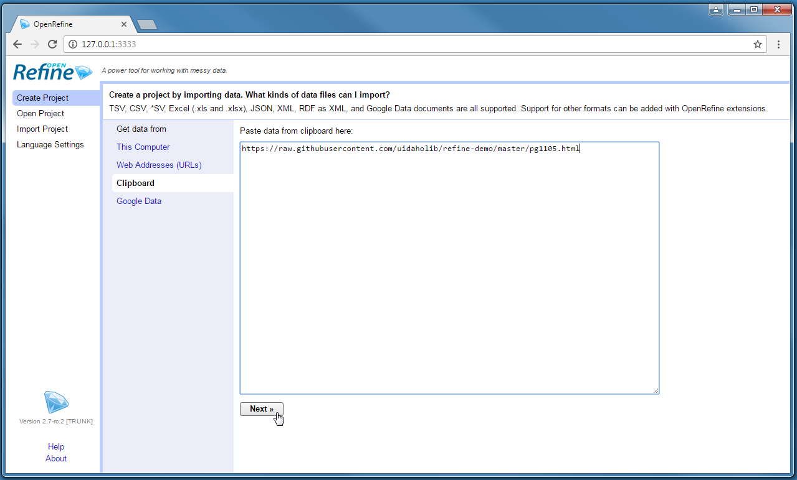

After clicking next, Refine should automatically identify the content as a line-based text file and the default parsing options should be correct.
Add a descriptive *Project name* at the top right and click *Create project*.
This will result in a project with one column and one row. 

### Fetch HTML

Refine's builtin function to retrieve a list of URLs is done by creating a new column.
Click on the menu arrow of *Column 1* > *Edit column* > *Add column by fetching urls*.

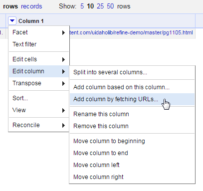

Name the new column `fetch`. 
The *throttle delay* option sets a pause time between requests to avoid being blocked by a server.
The default is conservative. 
After clicking okay, Refine will start requesting the URLs from the base column as if you were opening the pages in your browser, and will store each response in the cells of the new column.
In this case, there is one URL in *Column 1* resulting in one cell in the *fetch* column containing the full source for the Sonnets web page. 

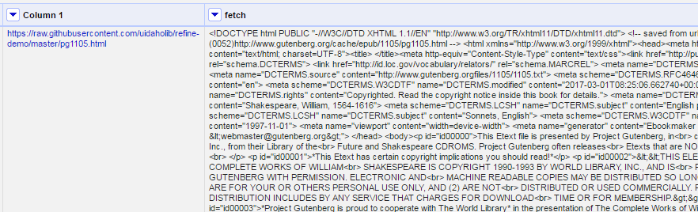

### Parse HTML

Much of the web page is not sonnet text and must be removed to create a clean data set.
First, it is necessary to identify a pattern that can isolate the desired content.
Items will often be nested in a unique container or given a meaningful class or id.
Click on the URL in *Column 1* to open the source in a new tab.
In this case the sonnets page does not have distinctive semantic markup, but each poem is contained inside a single `<p>` element. 
Thus, if all the paragraphs are selected, the sonnets can be extracted from the array.

On the *fetch* column, click on the menu arrow > *edit column* > *Add column based on this column*.
Give the new column the name `parse`, then click in the *Expression* text box.
Values in Refine can be transformed using the General Refine Expression Language ([GREL](https://github.com/OpenRefine/OpenRefine/wiki/General-Refine-Expression-Language)).
This box accepts GREL expressions that will be applied to each cell in the existing column to create values for the new one.
The default expression is `value`, the GREL variable representing the current value of a cell. 
This means that each cell will be copied to the new column. 
The preview below the expression box will reflect this.

GREL's `parseHtml()` function can read HTML content, allowing elements to be accessed using the jsoup [selector syntax](https://jsoup.org/cookbook/extracting-data/selector-syntax).
Delete `value`, then type `value.parseHtml().select("p")` into the expression box.

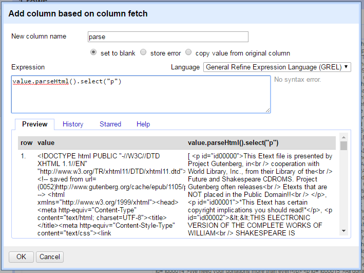

Notice that the preview now shows an [array](https://en.wikipedia.org/wiki/Array_data_type) of all the `p` elements found in the page.
Refine represents an array as a comma separated list enclosed in square brackets, for example `[ "one", "two", "three" ]`.

Try the following GREL expressions and watch the preview window to understand how they function.
Adding an index number to the expression selects an element from the array, for example `value.parseHtml().select("p")[0]`.
The beginning of the file contains many paragraphs of license information that are unnecessary for the data set. 
Skipping ahead, the first sonnet is found at `value.parseHtml().select("p")[37]`. 
GREL also supports using negative index numbers, thus `value.parseHtml().select("p")[-1]` will return the last item in the array. 
Working backwards, the last sonnet is at index `[-3]`.

Using these index numbers, it is possible to slice the array, extracting only the range of `p` that contain sonnets. 
Add the `slice()` function to the expression to preview the sub-set: `value.parseHtml().select("p").slice(37,-2)`.

> GREL variables and functions are strung together in sequence using a period, often starting with the raw cell `value`.
> This allows complex operations to be constructed by passing the results of each function to the next.
> Notice how it is possible to gradually build up an expression while checking the preview to see the result.
> Refine is visual and iterative. 
> Test out a transformation to see what happens--it is very easy to undo! 
> The full history of operations is recorded in the `Undo / Redo` tab. 

Clicking `ok` with this expression will result in a blank column, a common cause of confusion when working with arrays.
Refine will not store an array object as a cell value. 
It is necessary to use `toString()` or `join()` to convert the array into a string variable.
The `join()` function concatenates an array with the specified separator. 
For example, the expression `[ "one", "two", "three" ].join(";")` will result in the string "one;two;three".
Thus, the final expression to create the *parse* column is:

```
value.parseHtml().select("p").slice(37,-2).join("|")
```

Click Ok to create the column.

### Split Cells

The *parse* column now contains all the sonnets separated by "|", but the project still contains only one row. 
Individual rows for each sonnet can be created by splitting the cell.
Click the menu arrow on the *parse* column > *edit cells* > *split multivalued cells*. 
Enter the separator `|` that was used to `join` in the last step.

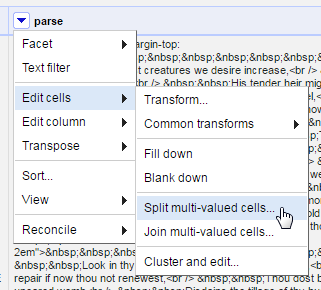

After this operation, the top of the project table should now read 154 rows.
Below the number is an option toggle "Show as: *rows* *records*".
Clicking on *records* will group the rows based on the original table, in this case it will read 1.
Keeping track of these numbers is an important "sanity check" when transforming data in Refine.
The 154 rows make sense because the ebook contained 154 sonnets, while 1 record represents the original table with only one row.
An unexpected number would indicate a problem with the transformation.

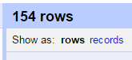

Each cell in the *parse* column now contains one sonnet surround by a `<p>` tag.
The tags can be cleaned up by parsing the HTML again.
Click on the *parse* column and select *edit cells* > *transform*.
This will bring up a dialog box similar to create new column.
Transform will overwrite the cells of the current column rather than creating a one.

In the expression box, type `value.parseHtml()`.
The preview will show a complete HTML tree starting with the `<html>` element.
It is important to note that `parseHtml()` will automatically fill in missing tags, allowing it to parse these cell values despite not being valid HTML documents.
Select the `p` tag, add an index number, and use the function `innerHtml()` to extract the sonnet text:

```
value.parseHtml().select("p")[0].innerHtml()
```

Click Ok to transform all 154 cells in the column. 

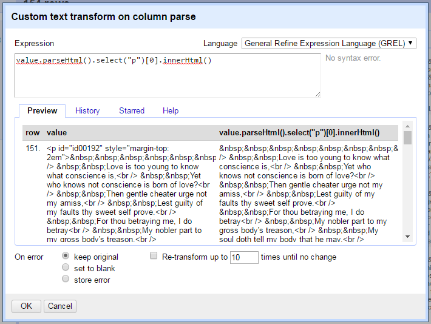

> In the expression above `select` returns an array of `p` elements even though there is only one in each cell.
> Attempting to pass an array to `innerHtml` will raise an error.
> Thus, an index number is necessary to select the first (and only) item in the array to pass the correct object type to `innerHtml`.
> Keep data object types in mind when debugging GREL expressions!

### Unescape

Each cell is filled with `&nbsp;`, an HTML entity used to represent "no-break space" since browsers ignore extra white space in the source.
These entities are common when harvesting web pages and can be quickly replaced with the corresponding plain text characters using the `unescape()` function.
On the *parse* column, select *Edit cells* > *Transform* and type `value.unescape('html')` in the expression box.
The entities will be replaced with normal whitespace.

### Extract Information with Array Functions

[GREL array functions]((https://github.com/OpenRefine/OpenRefine/wiki/GREL-Array-Functions) provide a powerful way to manipulate text data and can be used to finish processing the sonnets.
Any string value can be turned into an array using the `split()` function by providing the character or expression that separates the items (basically the opposite of `join()`). 

In the sonnets each line ends with `<br />`, providing a convenient separator for splitting.
The expression `split("<br />")` will create an array of the lines of each sonnet. 
Index numbers and slices can then be used to populate new columns.
Keep in mind that Refine will not output an array directly to a cell.
It will have to be converted back into a string value with `join()`.

Furthermore, the sonnet text contains a huge amount of unnecessary white space that was used to layout the poems in the ebook.
This can be cut from each line using the `trim()` function.
Trim automatically removes all leading and trailing white space, an essential for data cleaning. 

Create new columns from the *parse* column using *Edit column* > *Add column based on this column* with these names and expressions:

- number, `value.split("<br />")[0].trim()`
- first, `value.split("<br />")[1].trim()`

These expressions extract a single line from the array and trim, creating clean columns representing the sonnet number and first line. 
The next column to create is the full sonnet text which contains multiple lines.
However, `trim()` will only clean the beginning and end of the cell, leaving unnecessary whitespace in the body of the sonnet.
To trim each line individually use the GREL `forEach` control, a powerful loop that iterates over an array.

The `forEach()` expression asks for an array, a variable name, and a function applied to the variable.
Create new column named *text* from the *parse* column, and type `forEach(value.split("<br />"),lines,lines.trim())` in the expression box.
Look closely at the components:

- Array: `value.split("<br />")` creates an array from the string value in each cell.
- Variable: each item in the array is then represented as the variable `lines` (it could be anything, `v` is often used).
- Function: each item is then evaluated separately with the specified expression, `lines.trim()`.

The results of each separate function is returned as a new array.
Thus, the expression above will trim the individual line in each cell of the *parse* column.
Because the result is a new array, additional functions can be applied to the end of `forEach()`, such as slice and join.
The final expression to extract and clean the full sonnet text is:

```
forEach(value.split("<br />"),lines,lines.trim()).slice(1).join("\n")
```

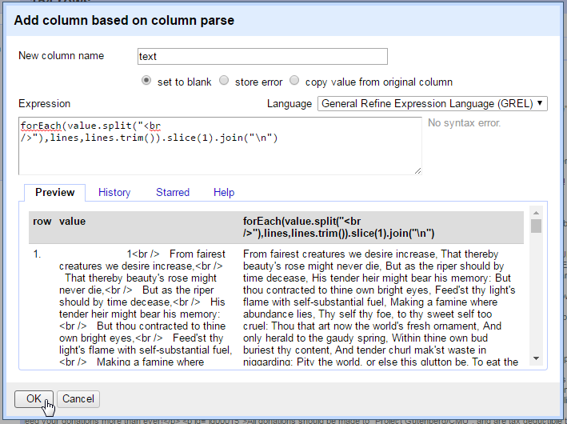

And add another new column from *parse* named *last* to represent the final couplet lines using:

```
forEach(value.split("<br />"),lines,lines.trim()).slice(-3).join("\n")
```

Finally, numeric columns can be added using the `length()` function.
Create new columns from the *text* column with the names and expressions below:

- characters, `value.length()`
- lines, `value.split(/\n/).length()`

### Cleanup and Export

In this example, many operations result in creating new columns. 
This is a typical Refine workflow allowing each transformation to be easily checked against the existing data.
At this point the unnecessary columns can be removed. 
Click on the *All* column > *Edit columns* > *Re-order / remove columns*.

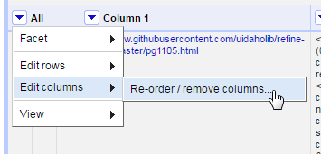

Drag unwanted column names to the right side, in this case *Column 1*, *fetch*, and *parse*. 
Drag the remaining columns into the desired order on the left side.
Click *ok* to remove and reorder the data set. 

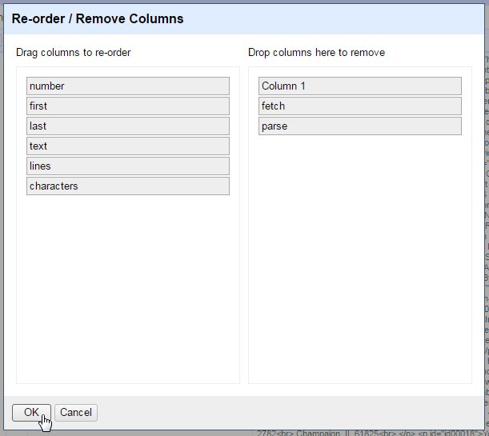

Use the export button to generate a version of the new sonnet table for use outside of Refine.

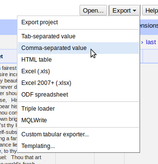
